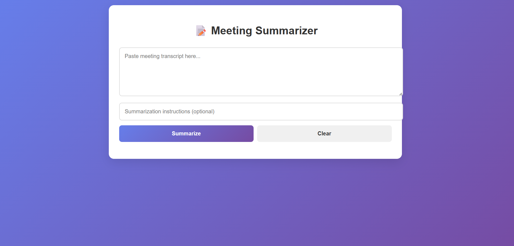

# 📝 Meeting Summarizer (Full Stack)

<p align="center">
  <b>An AI-powered meeting notes summarizer and sharer.</b><br/>
  Built with <b>Spring Boot (Java)</b> for backend and <b>React</b> for frontend.
</p>

<p align="center">
  <a href="https://meeting-summarizer-tau.vercel.app/"></a>
</p>

---

## ✨ Features

- 📂 Upload or paste **meeting transcripts**  
- 📝 Apply **custom summarization instructions** (e.g., "Summarize in bullet points")  
- 🤖 **AI generates structured summaries**  
- ✍️ Edit summaries before sharing  
- 📧 Share summaries via **email** (tested with MailHog/FakeSMTP for local dev)  

---

## 🛠️ Tech Stack

- **Backend:** ⚡ Spring Boot, Java, Maven  
- **Frontend:** ⚛️ React (Create React App)  
- **Email Service:** ✉️ Spring Boot Mail + MailHog (local testing)  
- **AI Service:** 🤖 Groq / LLM API  

---

## 🌍 Demo

👉 Check out the live version here:  
🔗 [**Meeting Summarizer Live Demo**](https://meeting-summarizer-tau.vercel.app/)  

---

## ⚙️ Setup & Installation

Clone the repository:
```bash
git clone https://github.com/him-anshu953/meeting-summarizer.git
cd meeting-summarizer

#Backend(Spring Boot)
cd src
mvn clean install
mvn spring-boot:run

#frontend(ReactJS)
cd ../summarizer-frontend
npm install
npm start
git clone https://github.com/him-anshu953/meeting-summarizer.git
cd meeting-summarizer
